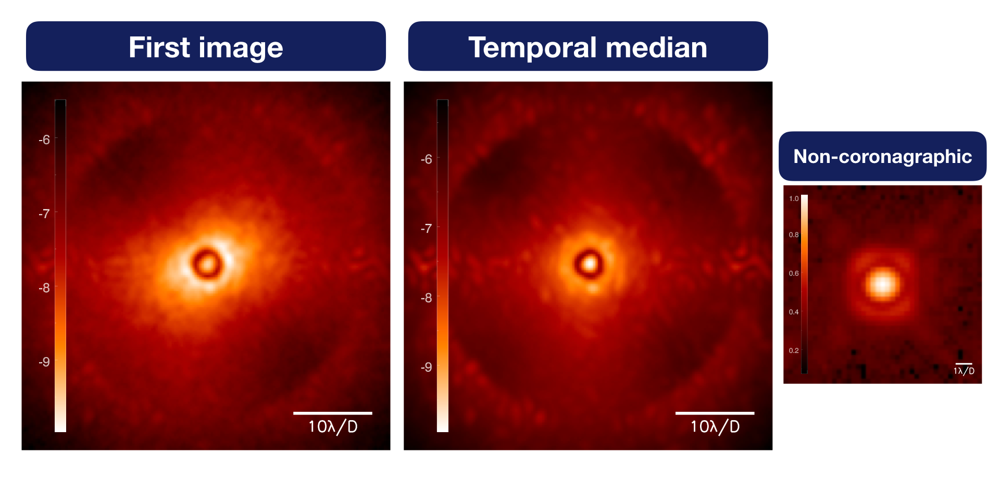
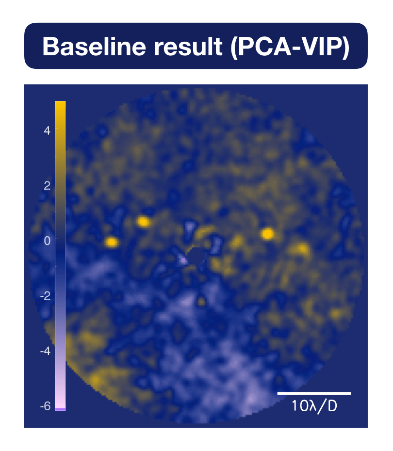

**On this page, we present the results obtained during the test phase of the data challenge (January 2020)** 

The feedbacks of this test phase were useful to improve the data challenge as a whole before settling the new deadline for the phase 1 (**30th of September 2020**). 

*Among the 51 participants who registered on CodaLab, we received 9 submissions. 
We publish here the results from the ADI sub-challenge (subchallenge_1/) on the VLT/SPHERE-IRDIS data taken with the K1 narrow-band filter (SPHERE_IRDIS_3/). 
We warmly thanks the participants who have submitted their results for this first test phase (note that the results submitted during the test phase are valid for the final phase 1).*

## Data VLT/SPHERE-IRDIS narrow-band
We chose this dataset among the data for the data challenge, ([presented on this page](https://exoplanet-imaging-challenge.github.io/datasets/)), because this is the most used SPHERE mode for exoplanet detection (e.g. for the SHINE large survey, [Chauvin et al., 2017](https://ui.adsabs.harvard.edu/abs/2017sf2a.conf..331C/abstract)). 

The observing conditions were not stable so the image cube shows large temporal variations.

| {:width="1200px"} |
|---|
| **Figure 1.** First frame of the provided data cube (left), temporal median of the data cube (middle) and normalised off-axis PSF (right). |

## Baseline result

In order to define the detection limit around which the synthetic planetary signals are injected, we ran a *classic annular PCA* from the [VIP toolbox](https://vip.readthedocs.io/en/latest/#). The resulting detection map is shown in Fig. 2 and the F1-score obtained for this widely used speckle-subtraction technique is *0.45*. 

| {:width="250px"} |
|---|
| **Figure 2.** Post-processed image using a classic annular PCA, as implemented in VIP. |

## Results from participants

From the submissions on CodaLab, *6* are valid and the results are shown below. 

The six detection maps are displayed from their minimum value to the participant provided threshold: every resel above this threshold is considered as a detection. The true positifs are encircled in dashed pale yellow. 

From these detection map, we extracted the true positive fraction (TPF, see definitions [here](https://exoplanet-imaging-challenge.github.io/metrics/)) and the false positive fraction (FPF). For this we first apply the same binary mask to all the detection maps (between a radius of 15 to 70 pixels, the detection maps being 159x159 pixels). We then varied the threshold from 0.1 to 10 and counted the detections per resels, compared to the injected signals. The FPF (red solid line) and the TPF (green solid line) as a function of the threshold are shown below the detection maps. *The goal is to minimize the area under the red curve (the FPF must be as close as possible to zero whatever the threshold) and to maximize the area under the green curve (the TPF must be as close as possible to one, whatever the threshold)*.

More information about each algorithm used can be find at the end of this page.

The global F1-score ([defined here](https://exoplanet-imaging-challenge.github.io/metrics/)) is also shwown below each algorithm.

| {:width="1200px"} |
|---|
| **Figure 3.** Detection maps submitted (the colorbar is given from the minimal value to the given threshold): at the participant-provided threshold, true detections are encircled in pale yellow. For each image we plotted the corresponding FPF (red) and TPF (green) as a function of threshold (vertical line is the participant-provided threshold),  and the F1-score is indicated below. |

## Discussions

### Visual inspection

* First, we can notice that similar concepts show very comparable structures in the detection map. For instance, *speckle subtraction techniques* (such as  the baseline, PCA_padova and PCA_mpia) show similar residuals, and *inverse problems based techniques* (such as FMMF and ANDROMEDA) show similar structures due to correlation of the residuals with the planetary signal model. The RSM map looks for a noise-planet regime switch along the temporal axis, leading to high signal-to-noise ratio. The STIM-ca map combines the PCA subtracted data by taking into account the temporal statistics of the residual noise to optimise the signal-to-noise ratio. 

* Second, some algorithm process the whole field of view (FMMF and marginally PCA_padova), while the other ones are working in inscribed circles.

* Third, similarly, some algorithm process the data as close as possible to the star (STIM+), whereas others are starting at larger angular separation (FMMF), depending on the concept behind (angular subtraction etc.)

### True Positive Fraction

In terms of TPF (green curves), the STIM+ map stands beyond other methods, by always revealing the 5 injected companions even at very high thresholds. 
Both FMMF and PCA-Padova provide a threshold (dashed vertical line) that detects the 5 injected companions.

### False Positive Fraction

In terms of FPF (red curves), the RSM map stands beyond other methods, with no false positives, whatever the threshold. 
On the contrary the speckle subtraction technique PCA_padova shows a high number of false positives all over the field of view. 
Notably, FMMF and ANDROMEDA, based on a very similar approach (modeling and tracking the planetary signal after a speckle subtraction), have a very similar trend of false positive fraction as a function of threshold.

*In terms of trade-off, FMMF is the most powerful technique to minimize the FPF while maximizing the TPF in order to detect the 5 injected signals above the participant-provided threshold (hence the larger F1-score).*

### Running time 

TBC

## Additional information about the algorithm used

* Forward Modeling Matched Filter ([FMMF](https://ui.adsabs.harvard.edu/abs/2017ApJ...842...14R/abstract)): available in the [pyKLIP](https://pyklip.readthedocs.io/en/latest/) package.
* ANDROMEDA ([ANDRO](https://ui.adsabs.harvard.edu/abs/2015A%26A...582A..89C/abstract)): available in the [VIP](https://pyklip.readthedocs.io/en/latest/) package. 
* Regime Switching Model ([RSM](https://ui.adsabs.harvard.edu/abs/2020A%26A...633A..95D/abstract)): available in the [VIP](https://pyklip.readthedocs.io/en/latest/) package.
* Standardized Trajectory Intensity Mean ([STIM](https://ui.adsabs.harvard.edu/abs/2019MNRAS.487.2262P/abstract)): available in the [VIP](https://pyklip.readthedocs.io/en/latest/) package.
* Principal Component Analysis ([PCA](https://ui.adsabs.harvard.edu/abs/2012MNRAS.427..948A/abstract), [KLIP](https://ui.adsabs.harvard.edu/abs/2012ApJ...755L..28S/abstract))

**We hope this page motivates you to participate too !**

